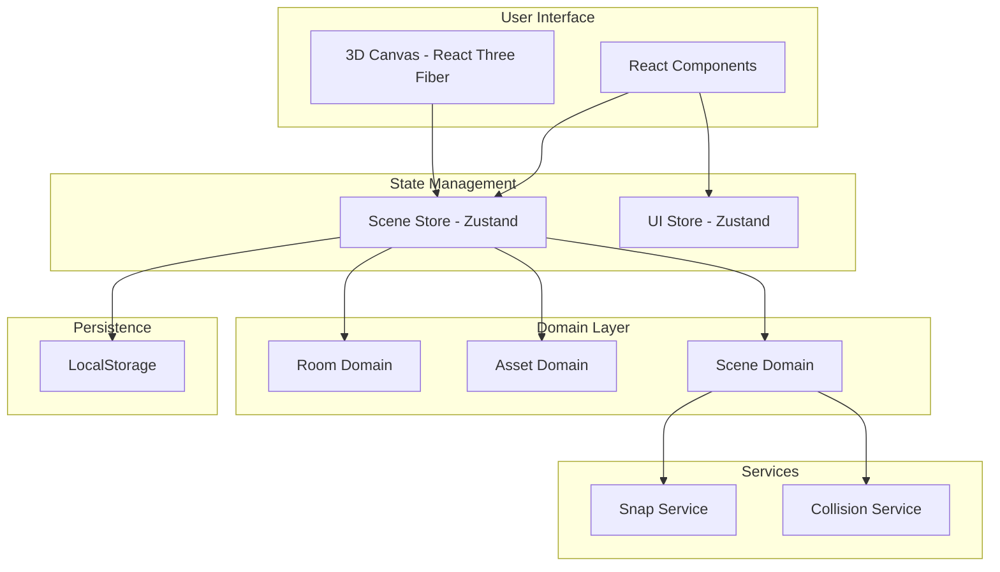

# Kitchen Planner - 3D Kitchen Design Tool

A web-based 3D kitchen planner that allows users to design kitchen layouts with drag-and-drop furniture placement, configurable walls, snapping mechanics, and collision detection.

## Quick Start

```bash
# Install dependencies
pnpm install

# Start development server
pnpm dev

# Open http://localhost:3000
```

---

## Architecture Overview

This project follows **Domain-Driven Design (DDD)** principles, separating business logic from UI concerns.



### Tech Stack

| Technology            | Purpose          | Why We Use It                             |
| --------------------- | ---------------- | ----------------------------------------- |
| **Next.js 16**        | Web framework    | Server-side rendering, file-based routing |
| **React Three Fiber** | 3D rendering     | React-friendly Three.js wrapper           |
| **@react-three/drei** | 3D utilities     | Pre-built controls, helpers               |
| **Zustand**           | State management | Performant for frequent 3D updates        |
| **TypeScript**        | Type safety      | Catch errors early, better IDE support    |
| **Tailwind CSS**      | Styling          | Rapid UI development                      |
| **shadcn/ui**         | UI components    | Consistent, accessible components         |

---

## Project Structure

```
kitchen-planner/
├── app/                          # Next.js App Router
│   ├── page.tsx                  # Main application page
│   ├── layout.tsx                # Root layout
│   └── globals.css               # Global styles
│
├── src/
│   ├── domains/                  # Business Logic (DDD)
│   │   ├── room/                 # Room configuration
│   │   ├── asset/                # Kitchen items
│   │   ├── scene/                # Scene orchestration
│   │   └── shared/               # Shared types
│   │
│   └── presentation/             # UI Layer
│       ├── components/
│       │   ├── canvas/           # 3D components
│       │   ├── panels/           # UI panels
│       │   └── layout/           # App layout
│       └── stores/               # Zustand stores
│
├── components/ui/                # shadcn/ui components
├── docs/                         # Documentation
└── .github/copilot/              # AI assistant instructions
```

---

## Documentation

| Document                                          | Description                         |
| ------------------------------------------------- | ----------------------------------- |
| [GETTING_STARTED.md](./docs/GETTING_STARTED.md)   | Setup guide for new developers      |
| [ARCHITECTURE.md](./docs/ARCHITECTURE.md)         | Complete architecture with diagrams |
| [3D_DEVELOPMENT.md](./docs/3D_DEVELOPMENT.md)     | React Three Fiber patterns          |
| [DOMAIN_MODELS.md](./docs/DOMAIN_MODELS.md)       | Business domain documentation       |
| [STATE_MANAGEMENT.md](./docs/STATE_MANAGEMENT.md) | Zustand stores guide                |
| [CONTRIBUTING.md](./docs/CONTRIBUTING.md)         | How to add features                 |

### For AI-Assisted Development

If using GitHub Copilot, Cursor, or other AI assistants:

| File                                                                               | Purpose                  |
| ---------------------------------------------------------------------------------- | ------------------------ |
| [.github/copilot/instructions.md](.github/copilot/instructions.md)                 | General coding standards |
| [.github/copilot/agents/feature-agent.md](.github/copilot/agents/feature-agent.md) | Adding new features      |
| [.github/copilot/agents/3d-agent.md](.github/copilot/agents/3d-agent.md)           | 3D/R3F development       |
| [.github/copilot/agents/domain-agent.md](.github/copilot/agents/domain-agent.md)   | Domain layer changes     |

---

## Key Features

- **3D Room Configuration** - Set room dimensions, toggle walls
- **Asset Library** - Pre-built kitchen items (fridge, oven, cabinets, etc.)
- **Drag and Drop** - Place and move items with mouse
- **Wall Snapping** - Items snap to walls and floor
- **Collision Detection** - Prevents overlapping items
- **Measurement Overlay** - Real-time dimensions display
- **Save/Load** - Persist designs locally

---
