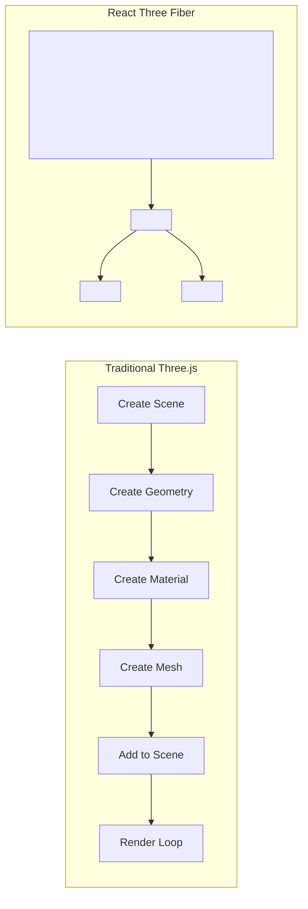
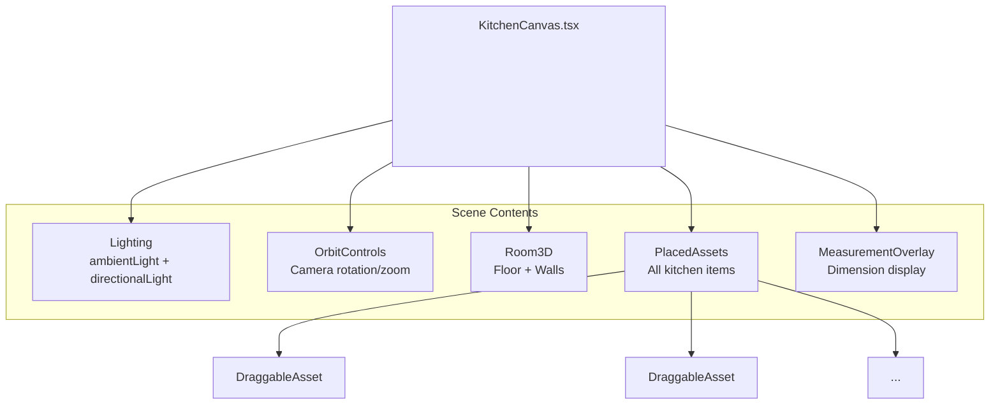

# 3D Development Guide

This guide covers React Three Fiber (R3F) patterns used in the Kitchen Planner.

---

## React Three Fiber Basics

### What is React Three Fiber?

R3F is a React renderer for Three.js. Instead of imperative Three.js code, you write declarative React components.



### The Canvas Component

Everything 3D happens inside `<Canvas>`:

```tsx
import { Canvas } from '@react-three/fiber';

function App() {
  return (
    <Canvas
      camera={{ position: [5, 5, 5], fov: 50 }}
      shadows
    >
      {/* 3D content goes here */}
      <ambientLight intensity={0.5} />
      <mesh>
        <boxGeometry args={[1, 1, 1]} />
        <meshStandardMaterial color="blue" />
      </mesh>
    </Canvas>
  );
}
```

---

## Project 3D Structure



---

## Key Components Explained

### KitchenCanvas.tsx

The main 3D container:

```tsx
export function KitchenCanvas() {
  return (
    <div className="relative h-full w-full">
      <Canvas
        camera={{ position: [width * 1.5, height * 2, depth * 1.5] }}
        shadows
      >
        <Suspense fallback={<LoadingFallback />}>
          {/* Lighting */}
          <ambientLight intensity={0.4} />
          <directionalLight position={[10, 10, 5]} castShadow />
          
          {/* Environment for reflections */}
          <Environment preset="apartment" />
          
          {/* Camera controls */}
          <OrbitControls 
            enabled={!isDraggingSceneAsset}  // Disable during drag
          />
          
          {/* Scene content */}
          <Room3D room={scene.room} />
          <PlacedAssets />
          
          {/* Optional helpers */}
          {showGrid && <Grid infiniteGrid />}
        </Suspense>
      </Canvas>
    </div>
  );
}
```

### Room3D.tsx

Renders the room with conditional walls:

```tsx
export function Room3D({ room }: { room: Room }) {
  const { width, height, depth } = room.dimensions;
  
  return (
    <group>
      {/* Floor */}
      <mesh rotation={[-Math.PI / 2, 0, 0]} receiveShadow>
        <planeGeometry args={[width, depth]} />
        <meshStandardMaterial color="#f5f5f5" />
      </mesh>
      
      {/* Conditional walls */}
      {room.walls.north && (
        <Wall position={[0, height/2, -depth/2]} size={[width, height]} />
      )}
      {room.walls.south && (
        <Wall position={[0, height/2, depth/2]} size={[width, height]} />
      )}
      {/* ... east, west walls */}
    </group>
  );
}
```

### DraggableAsset.tsx

Handles asset rendering and drag interaction:

```tsx
export function DraggableAsset({ placedAsset }: Props) {
  const meshRef = useRef<THREE.Mesh>(null);
  const [isDragging, setIsDragging] = useState(false);
  
  // Pointer handlers
  const handlePointerDown = (e) => {
    e.stopPropagation();
    setIsDragging(true);
    startSceneDrag();  // Disables OrbitControls
  };
  
  const handlePointerMove = (e) => {
    if (!isDragging) return;
    
    // Raycast to floor plane
    // Apply step snapping
    // Check wall snapping
    // Check collisions
    // Update position
  };
  
  const handlePointerUp = () => {
    setIsDragging(false);
    endSceneDrag();  // Re-enables OrbitControls
  };
  
  return (
    <mesh
      ref={meshRef}
      position={[pos.x, pos.y, pos.z]}
      onPointerDown={handlePointerDown}
    >
      <boxGeometry args={[width, height, depth]} />
      <meshStandardMaterial color={texture.color} />
    </mesh>
  );
}
```

---

## Common Patterns

### 1. Geometry Reuse

Create geometry once, reuse it:

```tsx
// Bad - creates new geometry every render
function Asset({ dimensions }) {
  return (
    <mesh>
      <boxGeometry args={[dimensions.width, dimensions.height, dimensions.depth]} />
    </mesh>
  );
}

// Good - memoize geometry
function Asset({ dimensions }) {
  const geometry = useMemo(
    () => new THREE.BoxGeometry(dimensions.width, dimensions.height, dimensions.depth),
    [dimensions.width, dimensions.height, dimensions.depth]
  );
  
  return (
    <mesh geometry={geometry}>
      <meshStandardMaterial />
    </mesh>
  );
}
```

### 2. Material Sharing

Same appearance = same material:

```tsx
// Create materials once
const materials = {
  wood: new THREE.MeshStandardMaterial({ color: '#8B4513' }),
  metal: new THREE.MeshStandardMaterial({ color: '#888888', metalness: 0.8 }),
  white: new THREE.MeshStandardMaterial({ color: '#ffffff' }),
};

function Asset({ textureType }) {
  return (
    <mesh material={materials[textureType]}>
      <boxGeometry />
    </mesh>
  );
}
```

### 3. Raycasting for Drag

Project mouse position to 3D space:

```tsx
function useDragOnFloor() {
  const { camera, raycaster } = useThree();
  
  // Floor plane for raycasting
  const floorPlane = useMemo(
    () => new THREE.Plane(new THREE.Vector3(0, 1, 0), 0),
    []
  );
  
  const getFloorPosition = (event) => {
    // Convert mouse to normalized device coordinates
    const mouse = new THREE.Vector2(
      (event.clientX / window.innerWidth) * 2 - 1,
      -(event.clientY / window.innerHeight) * 2 + 1
    );
    
    // Raycast
    raycaster.setFromCamera(mouse, camera);
    const intersectPoint = new THREE.Vector3();
    raycaster.ray.intersectPlane(floorPlane, intersectPoint);
    
    return intersectPoint;
  };
  
  return { getFloorPosition };
}
```

### 4. Step-Based Movement

Snap to grid during drag:

```tsx
function snapToStep(value: number, step: number): number {
  return Math.round(value / step) * step;
}

// In drag handler
const steppedX = snapToStep(rawPosition.x, 0.01);  // 10mm steps
const steppedZ = snapToStep(rawPosition.z, 0.01);
```

---

## drei Helpers We Use

### OrbitControls

Camera rotation and zoom:

```tsx
<OrbitControls
  makeDefault
  enabled={!isDragging}           // Disable during asset drag
  maxPolarAngle={Math.PI / 2}     // Prevent going below floor
  minDistance={1}
  maxDistance={20}
  enableDamping
/>
```

### Environment

Realistic lighting/reflections:

```tsx
<Environment preset="apartment" />
// Presets: apartment, city, dawn, forest, lobby, night, park, studio, sunset, warehouse
```

### Html

2D content in 3D space:

```tsx
<Html position={[0, 2, 0]} center>
  <div className="bg-white p-2 rounded shadow">
    Room: {width}m x {depth}m
  </div>
</Html>
```

### Grid

Visual floor grid:

```tsx
<Grid
  infiniteGrid
  cellSize={0.5}
  sectionSize={1}
  fadeDistance={30}
/>
```

---

## Performance Tips

### 1. Disable Controls During Drag

```tsx
<OrbitControls enabled={!isDraggingSceneAsset} />
```

### 2. Use Suspense for Loading

```tsx
<Suspense fallback={<LoadingSpinner />}>
  <HeavyComponent />
</Suspense>
```

### 3. Memoize Expensive Operations

```tsx
const geometry = useMemo(() => createComplexGeometry(), [dependencies]);
```

### 4. Clean Up on Unmount

```tsx
useEffect(() => {
  return () => {
    geometry.dispose();
    material.dispose();
  };
}, []);
```

---

## Debugging 3D Scenes

### Visual Helpers

```tsx
// Axes helper (red=X, green=Y, blue=Z)
<axesHelper args={[5]} />

// Grid on floor
<gridHelper args={[10, 10]} />

// Bounding box
<Box3Helper box={boundingBox} color="red" />
```

### Console Logging

```tsx
useFrame(() => {
  console.log('[v0] Camera position:', camera.position);
});
```

### Three.js Inspector

Install browser extension: [Three.js Developer Tools](https://chrome.google.com/webstore/detail/threejs-developer-tools)

---

## Common Issues

### Objects Not Visible

1. Check position - might be behind camera
2. Check scale - might be too small
3. Check material - might be transparent
4. Add lights - objects need light to be visible

### Performance Problems

1. Too many objects - use instancing
2. Large textures - compress images
3. Complex geometry - reduce polygons
4. Too many lights - limit to 3-4

### Drag Not Working

1. Check `onPointerDown` is attached
2. Check `stopPropagation()` is called
3. Ensure OrbitControls doesn't capture events
