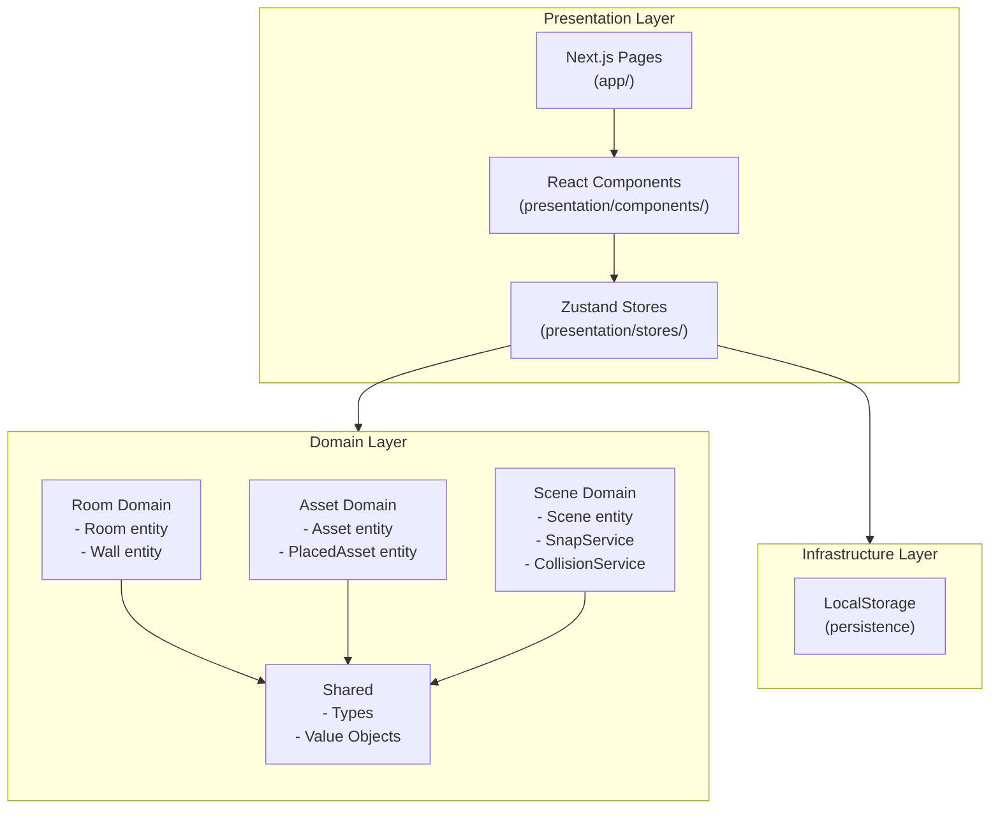
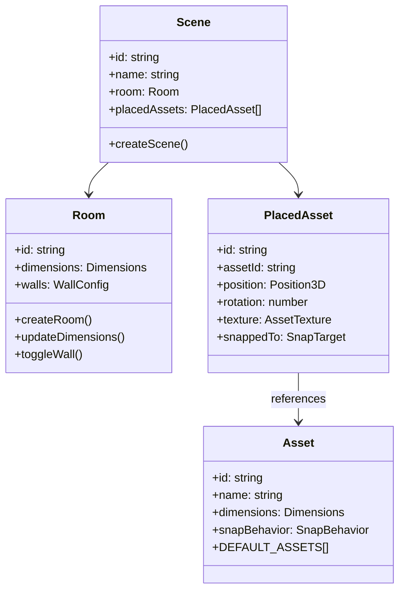
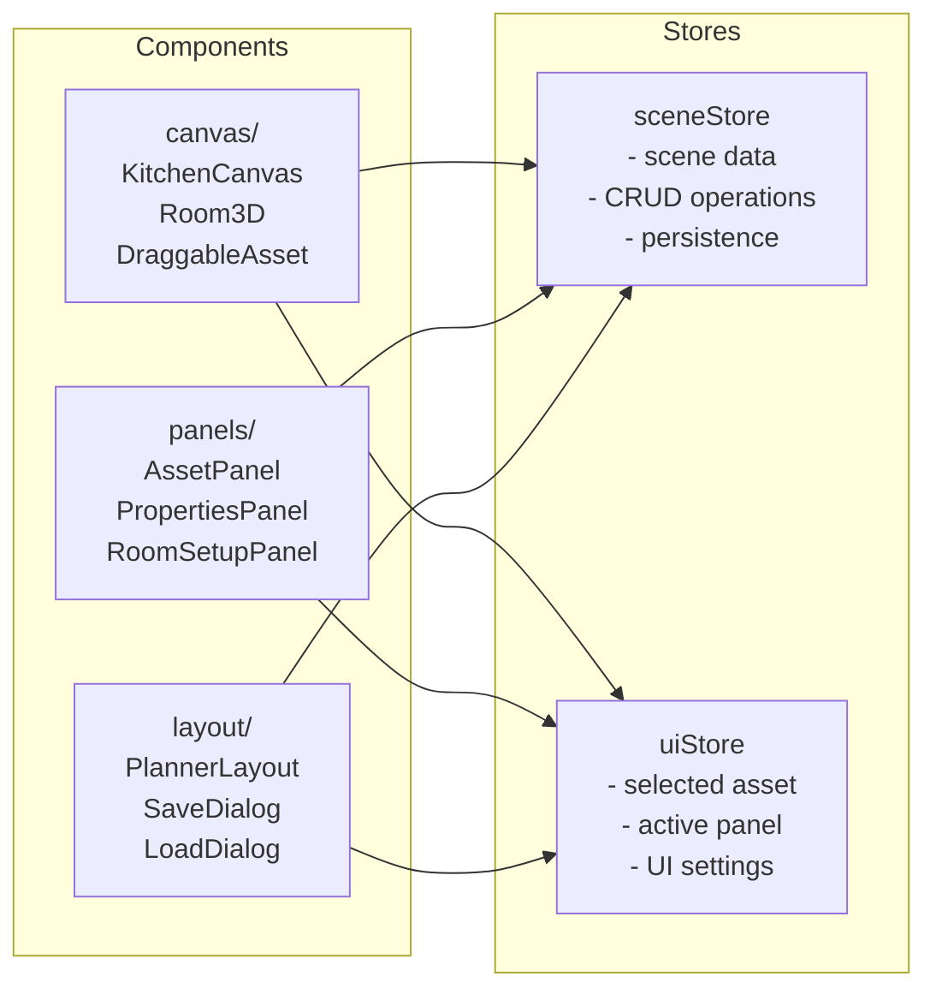
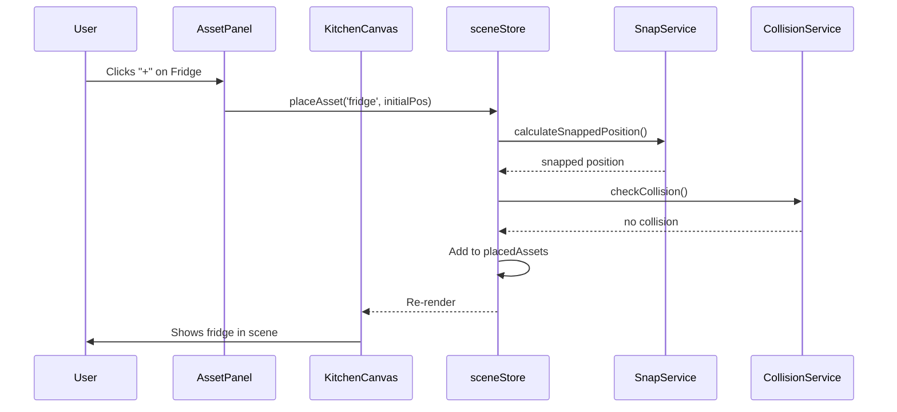
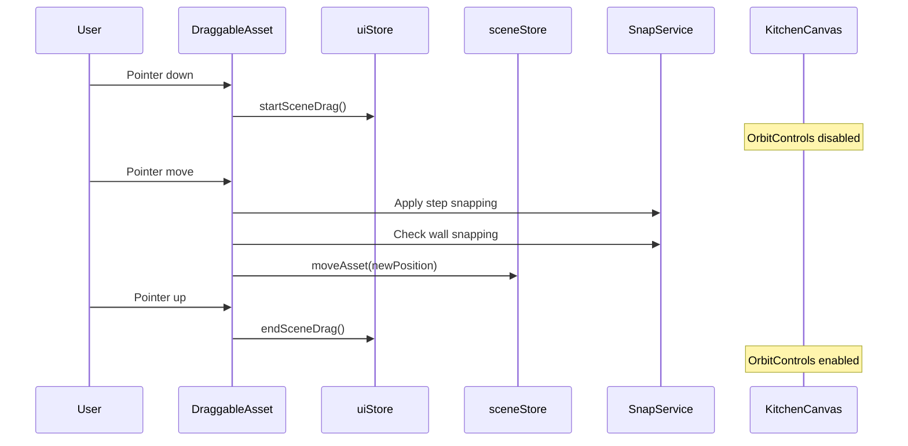

# Architecture Documentation

This document explains the complete architecture of the Kitchen Planner, following Domain-Driven Design (DDD) principles.

---

## High-Level Architecture



---

## Domain-Driven Design Explained

### What is DDD?

Domain-Driven Design organizes code around business concepts ("domains") rather than technical layers. For our kitchen planner:

| Domain | Business Concept | Contains |
|--------|------------------|----------|
| **Room** | The kitchen space | Dimensions, walls |
| **Asset** | Kitchen items | Fridge, oven, cabinets |
| **Scene** | The complete design | Room + placed assets |

### Why Use DDD?

1. **Business logic is isolated** - Easy to understand and test
2. **UI changes don't break logic** - Separate concerns
3. **Backend migration is easier** - Clear interfaces

---

## Detailed Architecture

### Layer 1: Domain Layer (`src/domains/`)

The heart of the application. Pure TypeScript, no React dependencies.



#### Domain Structure

```
domains/
├── room/
│   ├── entities/
│   │   ├── Room.ts        # Room creation and manipulation
│   │   └── Wall.ts        # Wall type definitions
│   └── index.ts           # Public exports
│
├── asset/
│   ├── entities/
│   │   ├── Asset.ts       # Asset definitions + DEFAULT_ASSETS
│   │   └── PlacedAsset.ts # Placed asset in scene
│   └── index.ts
│
├── scene/
│   ├── entities/
│   │   └── Scene.ts       # Scene composition
│   ├── services/
│   │   ├── SnapService.ts     # Wall/floor snapping logic
│   │   └── CollisionService.ts # AABB collision detection
│   └── index.ts
│
└── shared/
    └── types.ts           # Shared types (Position3D, Dimensions, etc.)
```

### Layer 2: Presentation Layer (`src/presentation/`)

React components and state management.



#### Component Categories

| Category | Purpose | Key Components |
|----------|---------|----------------|
| **canvas/** | 3D rendering | KitchenCanvas, Room3D, DraggableAsset |
| **panels/** | Side panels | AssetPanel, PropertiesPanel, RoomSetupPanel |
| **layout/** | App structure | PlannerLayout, SaveDialog, LoadDialog |

### Layer 3: Zustand Stores (`presentation/stores/`)

Global state management with clear separation:

```typescript
// sceneStore.ts - Kitchen data
interface SceneState {
  scene: Scene | null;
  
  // Room operations
  updateRoomDimensions: (dimensions) => void;
  toggleWall: (wall) => void;
  
  // Asset operations
  placeAsset: (assetId, position) => string;
  moveAsset: (id, position, snappedTo) => void;
  removeAsset: (id) => void;
  
  // Persistence
  saveScene: (name) => void;
  loadScene: (data) => void;
}

// uiStore.ts - UI state
interface UIState {
  selectedAssetId: string | null;
  activePanel: 'assets' | 'room' | 'properties';
  movementStep: 0.001 | 0.01 | 0.1;
  showGrid: boolean;
  showMeasurements: boolean;
}
```

---

## Data Flow

### Placing an Asset



### Moving an Asset



---

## Key Services

### SnapService

Handles positioning logic:

```typescript
// Wall snapping - when asset approaches wall
calculateSnappedPosition(position, asset, room) {
  // 1. Check distance to each wall
  // 2. If within threshold (0.25m), snap to wall
  // 3. Adjust position so asset edge touches wall
  // 4. Return snapped position + which wall/floor
}
```

**Snap Behaviors:**
- `floor` - Items like fridge, oven (sit on floor)
- `wall` - Items like shelves (attach to wall)
- `both` - Items that can go either place

### CollisionService

Prevents overlapping:

```typescript
// AABB (Axis-Aligned Bounding Box) collision
checkCollision(position, dimensions, otherAssets) {
  // For each other asset:
  // 1. Calculate bounding boxes
  // 2. Check if boxes overlap in all 3 axes
  // 3. Return collision status + which asset
}
```

---

## File Organization Principles

### Domain Files

- **Entities** - Core business objects (Room, Asset, Scene)
- **Services** - Business logic (SnapService, CollisionService)
- **Types** - Shared type definitions
- **No React** - Pure TypeScript only

### Presentation Files

- **Components** - React components
- **Stores** - Zustand state
- **React only** - No business logic

### Naming Conventions

```
Entity files:     PascalCase.ts      (Room.ts, Asset.ts)
Component files:  PascalCase.tsx     (AssetPanel.tsx)
Store files:      camelCase.ts       (sceneStore.ts)
Service files:    PascalCase.ts      (SnapService.ts)
```

---

## Performance Considerations

### 3D Rendering

1. **Geometry reuse** - Same dimensions = same geometry
2. **Material sharing** - Same texture = same material
3. **Conditional rendering** - Only render enabled walls
4. **OrbitControls disabled during drag** - Smoother interaction

### State Management

1. **Zustand selectors** - Only subscribe to needed data
2. **No prop drilling** - Components access stores directly
3. **Immutable updates** - Zustand handles this

### React

1. **Component splitting** - Small, focused components
2. **Memoization** - `useMemo` for expensive calculations
3. **useCallback** - Stable function references

---

## Extending the Architecture

### Adding a New Domain

1. Create folder: `src/domains/newDomain/`
2. Add entities: `entities/MyEntity.ts`
3. Add services if needed: `services/MyService.ts`
4. Export from index: `index.ts`
5. Use in stores/components

### Adding a New Feature

1. Identify which domain it belongs to
2. Add domain logic first (entities/services)
3. Add store actions if state needed
4. Add UI components last

See [CONTRIBUTING.md](./CONTRIBUTING.md) for detailed examples.
