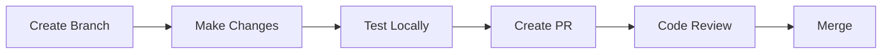

# Contributing Guide

This guide explains how to add new features and make changes to the Kitchen Planner.

---

## Development Workflow



### Quick Start

```bash
# 1. Create a feature branch
git checkout -b feature/my-feature

# 2. Make your changes
# ... edit files ...

# 3. Test locally
pnpm dev

# 4. Commit changes
git add .
git commit -m "feat: add new feature"

# 5. Push and create PR
git push origin feature/my-feature
```

---

## Adding a New Feature

### Example: Adding a Microwave Asset

#### Step 1: Add Domain Model

Edit `src/domains/asset/entities/Asset.ts`:

```typescript
// Add to DEFAULT_ASSETS array
{
  id: 'microwave',
  name: 'Microwave',
  category: 'appliance',
  dimensions: { width: 0.5, height: 0.3, depth: 0.4 },
  defaultTexture: { type: 'metal', color: '#333333' },
  snapBehavior: 'wall',
  icon: 'microwave',
},
```

#### Step 2: Add Icon Mapping (if needed)

Edit `src/presentation/components/panels/AssetPanel.tsx`:

```typescript
// Add to ICON_MAP
const ICON_MAP = {
  // ... existing icons
  microwave: Microwave,  // Import from lucide-react
};
```

#### Step 3: Test

1. Run `pnpm dev`
2. Check asset appears in panel
3. Test drag & drop
4. Test wall snapping (since `snapBehavior: 'wall'`)

---

### Example: Adding a New Panel Tab

#### Step 1: Update UI Store

Edit `src/presentation/stores/uiStore.ts`:

```typescript
// Add to PanelMode type
export type PanelMode = 'assets' | 'room' | 'properties' | 'user' | 'settings';
```

#### Step 2: Create Panel Component

Create `src/presentation/components/panels/SettingsPanel.tsx`:

```tsx
'use client';

import { useUIStore } from '@/src/presentation/stores/uiStore';

export function SettingsPanel() {
  const showGrid = useUIStore((state) => state.showGrid);
  const toggleGrid = useUIStore((state) => state.toggleGrid);
  
  return (
    <div className="flex flex-col h-full">
      <div className="px-4 py-3 border-b border-border">
        <h3 className="font-semibold text-sm">Settings</h3>
      </div>
      
      <div className="p-4 space-y-4">
        <label className="flex items-center gap-2">
          <input
            type="checkbox"
            checked={showGrid}
            onChange={toggleGrid}
          />
          <span>Show Grid</span>
        </label>
      </div>
    </div>
  );
}
```

#### Step 3: Export from Index

Edit `src/presentation/components/panels/index.ts`:

```typescript
export * from './SettingsPanel';
```

#### Step 4: Add to Layout

Edit `src/presentation/components/layout/PlannerLayout.tsx`:

```tsx
import { SettingsPanel } from '../panels';

// In the render function, add tab and content:
<TabsTrigger value="settings">Settings</TabsTrigger>

// In panel content switch:
{activePanel === 'settings' && <SettingsPanel />}
```

---

### Example: Adding a Domain Service

#### Step 1: Create Service

Create `src/domains/scene/services/MeasurementService.ts`:

```typescript
import type { PlacedAsset, Position3D, Dimensions } from '@/src/domains/shared/types';

/**
 * Calculate distance between two assets
 */
export function calculateDistance(
  assetA: PlacedAsset,
  assetB: PlacedAsset
): number {
  const dx = assetA.position.x - assetB.position.x;
  const dz = assetA.position.z - assetB.position.z;
  return Math.sqrt(dx * dx + dz * dz);
}

/**
 * Calculate distance from asset to nearest wall
 */
export function distanceToWall(
  position: Position3D,
  dimensions: Dimensions,
  roomDimensions: Dimensions
): { wall: string; distance: number } {
  const halfWidth = roomDimensions.width / 2;
  const halfDepth = roomDimensions.depth / 2;
  
  const distances = [
    { wall: 'north', distance: halfDepth + position.z },
    { wall: 'south', distance: halfDepth - position.z },
    { wall: 'east', distance: halfWidth - position.x },
    { wall: 'west', distance: halfWidth + position.x },
  ];
  
  return distances.reduce((min, curr) => 
    curr.distance < min.distance ? curr : min
  );
}
```

#### Step 2: Export from Domain

Edit `src/domains/scene/index.ts`:

```typescript
export * from './entities/Scene';
export * from './services/SnapService';
export * from './services/CollisionService';
export * from './services/MeasurementService';  // Add this
```

#### Step 3: Use in Components

```typescript
import { calculateDistance } from '@/src/domains/scene';

// In component
const distance = calculateDistance(selectedAsset, hoveredAsset);
```

---

## Code Style Guidelines

### TypeScript

```typescript
// Use explicit types for function parameters
function moveAsset(id: string, position: Position3D): void { }

// Use interfaces for objects
interface AssetConfig {
  name: string;
  dimensions: Dimensions;
}

// Use type for unions/aliases
type PanelMode = 'assets' | 'room' | 'properties';
```

### React Components

```tsx
// Use function components with explicit props
interface Props {
  asset: Asset;
  onSelect: (id: string) => void;
}

export function AssetCard({ asset, onSelect }: Props) {
  return ( ... );
}
```

### File Naming

```
Entities/Components:  PascalCase.ts(x)  - Room.ts, AssetPanel.tsx
Stores/Hooks:         camelCase.ts      - sceneStore.ts, useAssets.ts
Services:             PascalCase.ts     - SnapService.ts
Utilities:            camelCase.ts      - utils.ts
```

### Imports

```typescript
// 1. External packages
import { useState } from 'react';
import { Canvas } from '@react-three/fiber';

// 2. Internal absolute imports
import { Button } from '@/components/ui/button';
import { useSceneStore } from '@/src/presentation/stores';

// 3. Relative imports
import { AssetItem } from './AssetItem';
```

---

## Testing Checklist

Before submitting a PR, verify:

### Functionality
- [ ] Feature works as expected
- [ ] No console errors
- [ ] Existing features still work

### 3D Specific
- [ ] Objects render correctly
- [ ] Drag and drop works
- [ ] Snapping works
- [ ] No performance issues (smooth 60fps)

### UI
- [ ] Responsive on different screen sizes
- [ ] Accessible (keyboard navigation, screen readers)
- [ ] Consistent with existing design

### Code Quality
- [ ] No TypeScript errors
- [ ] Code follows style guidelines
- [ ] Functions are documented
- [ ] No unused imports/variables

---

## Commit Messages

Follow [Conventional Commits](https://www.conventionalcommits.org/):

```
feat: add microwave asset
fix: correct wall snapping calculation
docs: update architecture documentation
refactor: simplify collision detection
style: format code with prettier
chore: update dependencies
```

---

## Pull Request Template

```markdown
## Description
Brief description of changes

## Type of Change
- [ ] New feature
- [ ] Bug fix
- [ ] Documentation
- [ ] Refactoring

## Testing
How was this tested?

## Screenshots
If UI changes, add screenshots

## Checklist
- [ ] Code follows style guidelines
- [ ] Self-reviewed code
- [ ] Added necessary documentation
- [ ] No new warnings
```

---

## Getting Help

- **Architecture questions**: See [ARCHITECTURE.md](./ARCHITECTURE.md)
- **3D development**: See [3D_DEVELOPMENT.md](./3D_DEVELOPMENT.md)
- **State management**: See [STATE_MANAGEMENT.md](./STATE_MANAGEMENT.md)
- **Domain models**: See [DOMAIN_MODELS.md](./DOMAIN_MODELS.md)

For AI-assisted development:
- Check `.github/copilot/` for agent instructions
- Use the specialized agents for specific tasks
