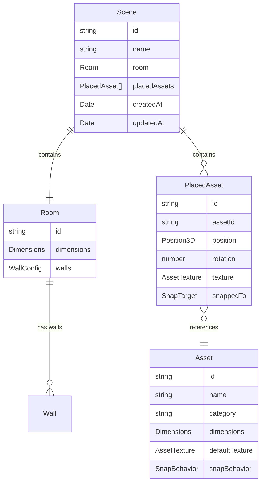
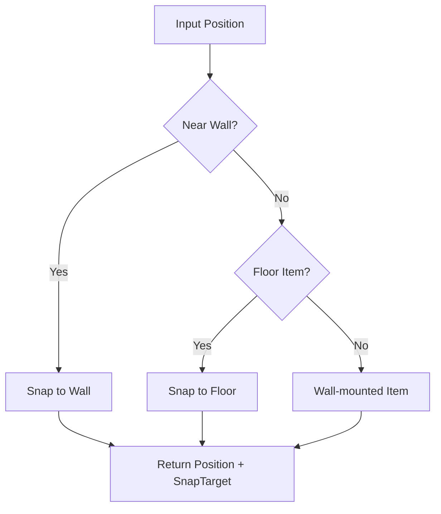
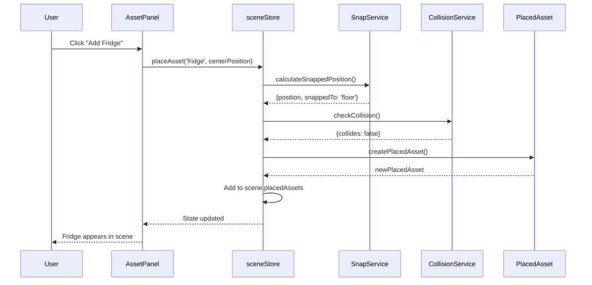

# Domain Models Documentation

This document describes the business domain models used in the Kitchen Planner.

---

## Domain Overview



---

## Shared Types

Located in `src/domains/shared/types.ts`:

```typescript
// 3D Position (in meters)
interface Position3D {
  x: number;  // Left/Right
  y: number;  // Up/Down
  z: number;  // Forward/Back
}

// Object dimensions (in meters)
interface Dimensions {
  width: number;   // X-axis size
  height: number;  // Y-axis size
  depth: number;   // Z-axis size
}

// Texture configuration
interface AssetTexture {
  type: TextureType;
  color: string;
}

type TextureType = 'wood' | 'plastic' | 'metal' | 'white' | 'custom';

// Where asset can snap
type SnapBehavior = 'floor' | 'wall' | 'both';

// What asset is currently snapped to
type SnapTarget = 'floor' | 'north' | 'south' | 'east' | 'west' | null;
```

---

## Room Domain

### Room Entity

```typescript
// src/domains/room/entities/Room.ts

interface Room {
  id: string;
  dimensions: Dimensions;
  walls: WallConfig;
}

interface WallConfig {
  north: boolean;  // Back wall (negative Z)
  south: boolean;  // Front wall (positive Z)
  east: boolean;   // Right wall (positive X)
  west: boolean;   // Left wall (negative X)
}
```

### Room Functions

```typescript
// Create a new room with default settings
function createRoom(
  width: number,
  height: number,
  depth: number
): Room;

// Update room dimensions
function updateRoomDimensions(
  room: Room,
  dimensions: Partial<Dimensions>
): Room;

// Toggle a specific wall
function toggleWall(
  room: Room,
  wall: keyof WallConfig
): Room;
```

### Coordinate System

```
        North Wall (-Z)
            │
            │
   West ────┼──── East
  Wall      │     Wall
  (-X)      │     (+X)
            │
        South Wall (+Z)

Y-axis points UP (height)
```

---

## Asset Domain

### Asset Entity (Template)

```typescript
// src/domains/asset/entities/Asset.ts

interface Asset {
  id: string;
  name: string;
  category: AssetCategory;
  dimensions: Dimensions;
  defaultTexture: AssetTexture;
  snapBehavior: SnapBehavior;
  icon?: string;  // Icon name for UI
}

type AssetCategory = 'appliance' | 'furniture' | 'storage';
```

### Default Assets

Pre-defined kitchen items:

| ID | Name | Dimensions (W x H x D) | Snap |
|----|------|------------------------|------|
| fridge | Refrigerator | 0.8m x 1.8m x 0.7m | floor |
| oven | Oven/Stove | 0.6m x 0.9m x 0.6m | floor |
| dishwasher | Dishwasher | 0.6m x 0.85m x 0.6m | floor |
| sink | Sink Cabinet | 0.8m x 0.9m x 0.6m | floor |
| cabinet-base | Base Cabinet | 0.6m x 0.9m x 0.6m | floor |
| cabinet-wall | Wall Cabinet | 0.6m x 0.6m x 0.35m | wall |
| shelf | Shelf | 0.8m x 0.03m x 0.25m | wall |
| island | Kitchen Island | 1.2m x 0.9m x 0.8m | floor |

### PlacedAsset Entity (Instance)

```typescript
// src/domains/asset/entities/PlacedAsset.ts

interface PlacedAsset {
  id: string;           // Unique instance ID
  assetId: string;      // Reference to Asset template
  position: Position3D; // Current position in scene
  rotation: number;     // Y-axis rotation (radians)
  texture: AssetTexture; // Current texture
  snappedTo: SnapTarget; // What it's snapped to
}
```

### PlacedAsset Functions

```typescript
// Create a new placed asset
function createPlacedAsset(
  assetId: string,
  position: Position3D,
  texture?: AssetTexture
): PlacedAsset;

// Update position
function updatePosition(
  placed: PlacedAsset,
  position: Position3D,
  snappedTo: SnapTarget
): PlacedAsset;

// Update texture
function updateTexture(
  placed: PlacedAsset,
  texture: AssetTexture
): PlacedAsset;
```

---

## Scene Domain

### Scene Entity

```typescript
// src/domains/scene/entities/Scene.ts

interface Scene {
  id: string;
  name: string;
  room: Room;
  placedAssets: PlacedAsset[];
  createdAt: Date;
  updatedAt: Date;
}
```

### Scene Functions

```typescript
// Create a new scene
function createScene(
  name: string,
  room: Room
): Scene;

// Add asset to scene
function addAsset(
  scene: Scene,
  placedAsset: PlacedAsset
): Scene;

// Remove asset from scene
function removeAsset(
  scene: Scene,
  placedAssetId: string
): Scene;
```

---

## Scene Services

### SnapService

Handles positioning and snapping logic:

```typescript
// src/domains/scene/services/SnapService.ts

// Calculate snapped position for an asset
function calculateSnappedPosition(
  position: Position3D,
  asset: Asset,
  room: Room
): SnapResult;

interface SnapResult {
  position: Position3D;
  snappedTo: SnapTarget;
}
```

**Snapping Logic:**



### CollisionService

Prevents overlapping assets:

```typescript
// src/domains/scene/services/CollisionService.ts

// Check if position causes collision
function checkCollision(
  position: Position3D,
  dimensions: Dimensions,
  otherAssets: PlacedAsset[],
  assetLibrary: Map<string, Asset>,
  excludeId?: string  // Ignore self
): CollisionResult;

interface CollisionResult {
  collides: boolean;
  collidingWith: string[];  // IDs of colliding assets
}

// Find nearest valid position
function findNearestValidPosition(
  position: Position3D,
  dimensions: Dimensions,
  otherAssets: PlacedAsset[],
  assetLibrary: Map<string, Asset>,
  room: Room
): Position3D | null;

// Clamp position to room bounds
function clampToRoomBounds(
  position: Position3D,
  dimensions: Dimensions,
  room: Room
): Position3D;
```

**Collision Detection (AABB):**

```
Asset A                Asset B
┌─────────┐           ┌─────────┐
│         │           │         │
│   min ──┼───────────┼── max   │
│         │ OVERLAP   │         │
│   max ──┼───────────┼── min   │
│         │           │         │
└─────────┘           └─────────┘

Collision if:
  A.min.x < B.max.x AND A.max.x > B.min.x
  AND same for Y and Z axes
```

---

## Data Flow Example

### Placing a New Asset



---

## Persistence Format

When saving a scene:

```typescript
interface SavedScene {
  version: string;  // Schema version
  scene: {
    id: string;
    name: string;
    room: {
      dimensions: { width, height, depth };
      walls: { north, south, east, west };
    };
    placedAssets: Array<{
      id: string;
      assetId: string;
      position: { x, y, z };
      rotation: number;
      texture: { type, color };
      snappedTo: string | null;
    }>;
  };
  savedAt: string;  // ISO date
}
```

---

## Extending Domain Models

### Adding a New Asset Type

1. Add to `DEFAULT_ASSETS` in `Asset.ts`:

```typescript
{
  id: 'microwave',
  name: 'Microwave',
  category: 'appliance',
  dimensions: { width: 0.5, height: 0.3, depth: 0.4 },
  defaultTexture: { type: 'metal', color: '#333333' },
  snapBehavior: 'wall',  // Mounts on wall
  icon: 'microwave',
},
```

2. Add icon mapping in `AssetPanel.tsx` if needed

### Adding a New Texture Type

1. Add to `TextureType` in `types.ts`:

```typescript
type TextureType = 'wood' | 'plastic' | 'metal' | 'white' | 'marble' | 'custom';
```

2. Add color option in `PropertiesPanel.tsx`

### Adding Asset Rotation

Currently rotation is stored but not implemented in UI. To enable:

1. Add rotation controls in `PropertiesPanel.tsx`
2. Apply rotation in `DraggableAsset.tsx`:

```tsx
<mesh rotation={[0, placedAsset.rotation, 0]}>
```
