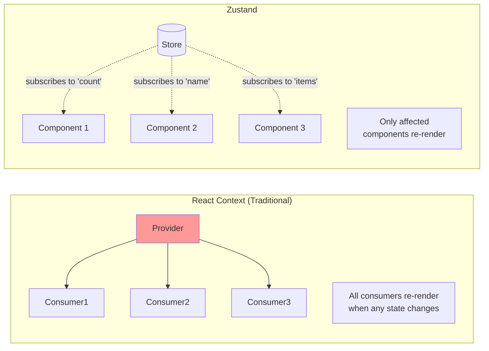
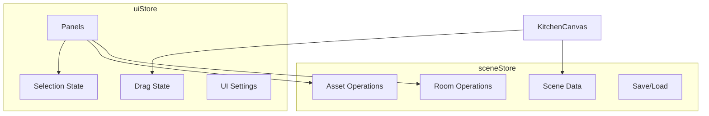

# State Management Guide

This document explains how state is managed in the Kitchen Planner using Zustand.

---

## Why Zustand?



**Benefits for 3D applications:**
- Fine-grained subscriptions (no unnecessary re-renders)
- Works outside React components
- Simple API, minimal boilerplate
- Great TypeScript support

---

## Store Architecture



---

## sceneStore

Located at `src/presentation/stores/sceneStore.ts`

### State Structure

```typescript
interface SceneState {
  // Core data
  scene: Scene | null;
  
  // Room operations
  updateRoomDimensions: (dimensions: Partial<Dimensions>) => void;
  toggleWall: (wall: WallPosition) => void;
  
  // Asset operations
  placeAsset: (assetId: string, position: Position3D) => string | null;
  moveAsset: (id: string, position: Position3D, snappedTo: SnapTarget) => void;
  removeAsset: (id: string) => void;
  updateAssetTexture: (id: string, texture: Partial<AssetTexture>) => void;
  
  // Persistence
  saveScene: (name: string) => void;
  loadScene: (data: SavedScene) => void;
  getSavedScenes: () => SavedScene[];
  deleteSavedScene: (id: string) => void;
  
  // Helpers
  getAssetLibrary: () => Map<string, Asset>;
}
```

### Usage Examples

```typescript
// In a component
function MyComponent() {
  // Subscribe to specific state
  const scene = useSceneStore((state) => state.scene);
  const placeAsset = useSceneStore((state) => state.placeAsset);
  
  // Use the action
  const handleAdd = () => {
    placeAsset('fridge', { x: 0, y: 0.9, z: 0 });
  };
  
  return <button onClick={handleAdd}>Add Fridge</button>;
}
```

```typescript
// Outside React (in services, utilities)
const { scene, moveAsset } = useSceneStore.getState();

if (scene) {
  moveAsset(assetId, newPosition, 'floor');
}
```

### Key Actions

#### placeAsset

```typescript
placeAsset: (assetId, position) => {
  // 1. Get asset definition
  const asset = getAssetById(assetId);
  
  // 2. Create placed asset instance
  const placed = createPlacedAsset(assetId, position, asset.defaultTexture);
  
  // 3. Add to scene
  set((state) => ({
    scene: {
      ...state.scene,
      placedAssets: [...state.scene.placedAssets, placed],
    },
  }));
  
  // 4. Return ID for selection
  return placed.id;
}
```

#### moveAsset

```typescript
moveAsset: (id, position, snappedTo) => {
  set((state) => ({
    scene: {
      ...state.scene,
      placedAssets: state.scene.placedAssets.map((asset) =>
        asset.id === id
          ? { ...asset, position, snappedTo }
          : asset
      ),
    },
  }));
}
```

---

## uiStore

Located at `src/presentation/stores/uiStore.ts`

### State Structure

```typescript
interface UIState {
  // Selection
  selectedAssetId: string | null;
  hoveredAssetId: string | null;
  
  // Drag state (from panel)
  isDragging: boolean;
  dragAssetType: string | null;
  
  // Drag state (in scene)
  isDraggingSceneAsset: boolean;
  
  // Movement settings
  movementStep: MovementStep;  // 0.001 | 0.01 | 0.1
  
  // Panels
  activePanel: PanelMode;  // 'assets' | 'room' | 'properties' | 'user'
  
  // View settings
  showMeasurements: boolean;
  showGrid: boolean;
  viewMode: ViewMode;  // '3d' | 'topdown'
  
  // Modals
  showSaveDialog: boolean;
  showLoadDialog: boolean;
  showRoomSetup: boolean;
}
```

### Actions

```typescript
// Selection - auto-switches to properties panel
selectAsset: (id) => set({ 
  selectedAssetId: id,
  activePanel: id ? 'properties' : 'assets',
});

// Drag from asset panel
startDrag: (assetType) => set({ isDragging: true, dragAssetType: assetType });
endDrag: () => set({ isDragging: false, dragAssetType: null });

// Drag in scene (disables OrbitControls)
startSceneDrag: () => set({ isDraggingSceneAsset: true });
endSceneDrag: () => set({ isDraggingSceneAsset: false });

// Settings
setMovementStep: (step) => set({ movementStep: step });
toggleGrid: () => set((state) => ({ showGrid: !state.showGrid }));
toggleMeasurements: () => set((state) => ({ showMeasurements: !state.showMeasurements }));
```

### Usage Patterns

```typescript
// Subscribe to selection
const selectedId = useUIStore((state) => state.selectedAssetId);
const selectAsset = useUIStore((state) => state.selectAsset);

// Check drag state for OrbitControls
const isDraggingSceneAsset = useUIStore((state) => state.isDraggingSceneAsset);

<OrbitControls enabled={!isDraggingSceneAsset} />
```

---

## Persistence

### Auto-save to LocalStorage

The sceneStore automatically persists state:

```typescript
// Using Zustand persist middleware
const useSceneStore = create(
  persist(
    (set, get) => ({
      // ... state and actions
    }),
    {
      name: 'kitchen-planner-scene',
      partialize: (state) => ({ scene: state.scene }),  // Only persist scene
    }
  )
);
```

### Manual Save/Load

```typescript
// Save current scene
const saveScene = useSceneStore((state) => state.saveScene);
saveScene('My Kitchen Design');

// Get saved scenes
const getSavedScenes = useSceneStore((state) => state.getSavedScenes);
const scenes = getSavedScenes();

// Load a saved scene
const loadScene = useSceneStore((state) => state.loadScene);
loadScene(savedSceneData);

// Delete a saved scene
const deleteSavedScene = useSceneStore((state) => state.deleteSavedScene);
deleteSavedScene(sceneId);
```

---

## Best Practices

### 1. Use Selectors

```typescript
// Good - only re-renders when selectedAssetId changes
const selectedId = useUIStore((state) => state.selectedAssetId);

// Bad - re-renders on any state change
const { selectedAssetId } = useUIStore();
```

### 2. Separate Concerns

```typescript
// Good - each subscription is independent
const scene = useSceneStore((state) => state.scene);
const selectedId = useUIStore((state) => state.selectedAssetId);

// Avoid - mixing unrelated state
const state = useSceneStore();  // Re-renders on any change
```

### 3. Actions Outside Render

```typescript
// Good - get actions once
const placeAsset = useSceneStore((state) => state.placeAsset);

// Avoid - don't inline getState in render
<button onClick={() => useSceneStore.getState().placeAsset(...)}>
```

### 4. Derived State

```typescript
// Good - compute in component or useMemo
const selectedAsset = useMemo(() => {
  if (!scene || !selectedId) return null;
  return scene.placedAssets.find((a) => a.id === selectedId);
}, [scene, selectedId]);

// Avoid - storing derived state in store
```

---

## Debugging

### Zustand DevTools

```typescript
import { devtools } from 'zustand/middleware';

const useSceneStore = create(
  devtools(
    (set) => ({
      // ... state
    }),
    { name: 'SceneStore' }
  )
);
```

Then use Redux DevTools browser extension.

### Logging Middleware

```typescript
const log = (config) => (set, get, api) =>
  config(
    (...args) => {
      console.log('[v0] State before:', get());
      set(...args);
      console.log('[v0] State after:', get());
    },
    get,
    api
  );

const useStore = create(log((set) => ({ ... })));
```

### Subscribe to Changes

```typescript
// Listen to specific state changes
useSceneStore.subscribe(
  (state) => state.scene?.placedAssets.length,
  (count) => console.log('[v0] Asset count:', count)
);
```

---

## Store Initialization

### sceneStore Initialization

```typescript
// Called on app mount
export function initializeDefaultRoom() {
  const { scene, loadScene } = useSceneStore.getState();
  
  // If no existing scene, create default
  if (!scene) {
    const defaultRoom = createRoom(4, 2.5, 3);
    const defaultScene = createScene('New Kitchen', defaultRoom);
    
    useSceneStore.setState({ scene: defaultScene });
  }
}
```

### In Components

```typescript
// In KitchenCanvas.tsx
useEffect(() => {
  initializeDefaultRoom();
}, []);
```

---

## Adding New State

### Adding to Existing Store

```typescript
// 1. Add to interface
interface UIState {
  // ... existing
  newSetting: boolean;
  setNewSetting: (value: boolean) => void;
}

// 2. Add initial value and action
const useUIStore = create<UIState>((set) => ({
  // ... existing
  newSetting: false,
  setNewSetting: (value) => set({ newSetting: value }),
}));
```

### Creating a New Store

```typescript
// src/presentation/stores/newStore.ts
import { create } from 'zustand';

interface NewState {
  value: string;
  setValue: (value: string) => void;
}

export const useNewStore = create<NewState>((set) => ({
  value: '',
  setValue: (value) => set({ value }),
}));

// Export from index.ts
export * from './newStore';
```
